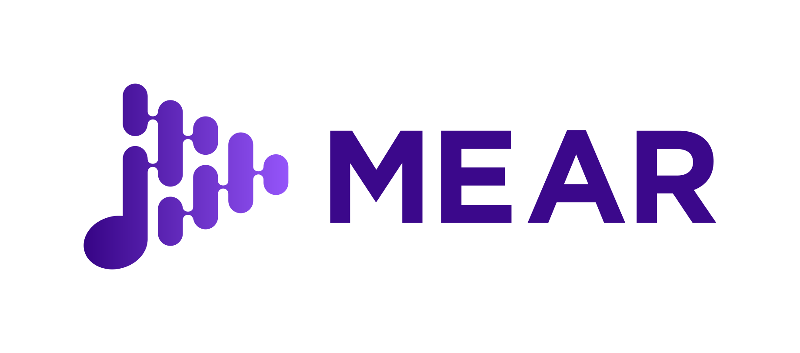

# Mear

<h1 align=center>

</h1>

Mear is a music player app for Android phone. 
  
## Dependencies
* [anko](https://github.com/Kotlin/anko)

## Built with
* [Kotlin](https://github.com/JetBrains/kotlin)
* Android Studio

## Contributing

Please read [CONTRIBUTING.md](CONTRIBUTING.md) for details on the code of conduct, and the process for submitting pull requests to to the project.

## Versioning

Currently in development and no version has been released

## Authors
* **Kun Deng** [amazing-username](https://github.com/amazing-username)

## License

This project is licensed under the MIT License - see the [License](LICENSE) file for details
